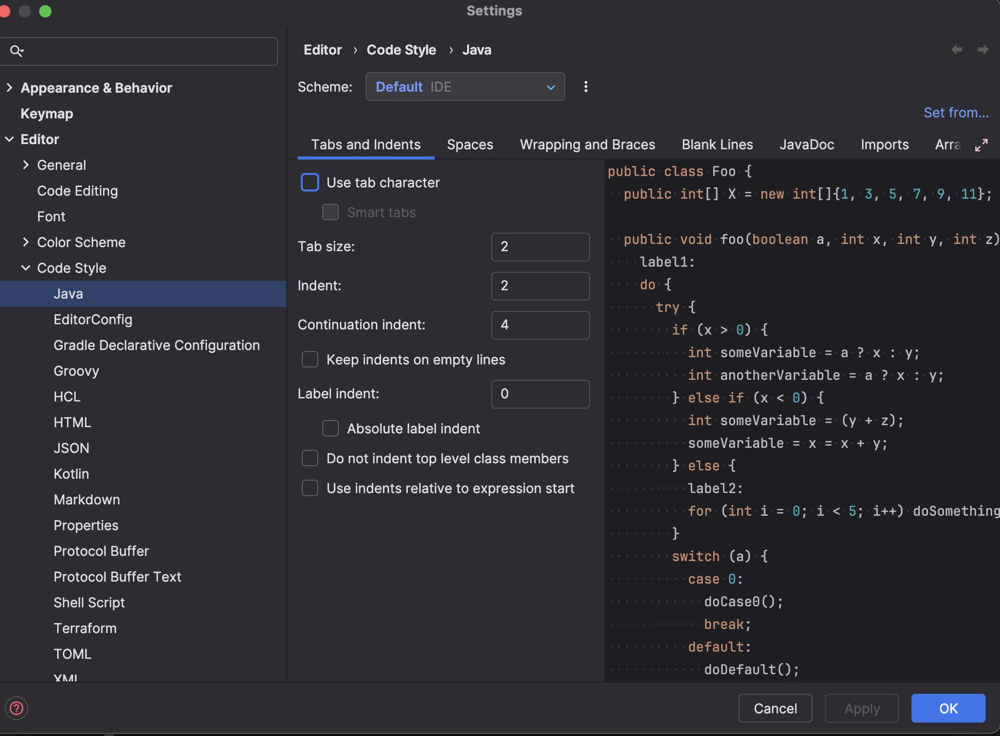
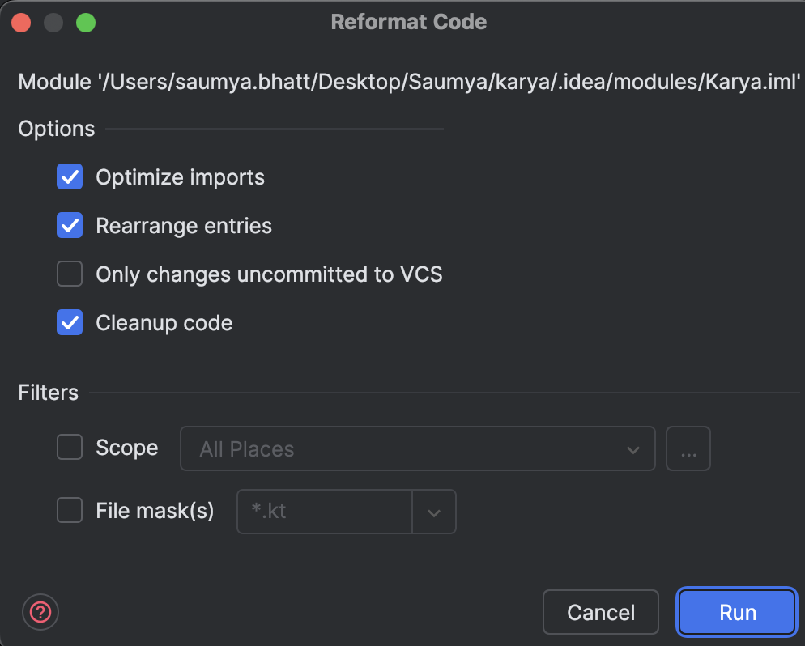

# Contributing to Karya

## Local Setup

This will help set up and run the application locally. For this, we shall be creating a Postgres instance as a repo
provider, Redis for locks provider and RabbitMq as queue provider.

### Pre-Requisites

- Make sure docker is installed on your machine
- Run the following command to start the required provider services
  ```shell
  docker-compose -f ./docs/local-setup/providers.docker-compose.yml up -d
  ```
- Create a `providers.yml` file.
  - A sample file can be found [here](../configs/providers.yml).
  - For more information on how to configure the providers, refer to the [Connectors](../README.md/#connectors) section.
- Create a `executor.yml` file.
  - A sample file can be found [here](../configs/executor.yml).
  - For more information on how to configure the executor, refer to the [Executor](../README.md/#executor) section.
- Create a `scheduler.yml` file.
  - A sample file can be found [here](../configs/scheduler.yml).
  - For more information on how to configure the scheduler, refer to the [Scheduler](../README.md/#scheduler) section.

### Running the application

Start the application in the following order:

1. Start the server
   ```shell 
    export KARYA_PROVIDERS_CONFIG_PATH=path/to/providers.yml
   
    ./gradlew servers-server:run
   ```
   
2. Start the executor
    ```shell 
    export KARYA_PROVIDERS_CONFIG_PATH=path/to/providers.yml
    export KARYA_EXECUTOR_CONFIG_PATH=path/to/executor.yml
   
    ./gradlew servers-executor:run
   ```

3. Start the scheduler
    ```shell 
    export KARYA_PROVIDERS_CONFIG_PATH=path/to/providers.yml
    export KARYA_SCHEDULER_CONFIG_PATH=path/to/scheduler.yml
   
    ./gradlew servers-scheduler:run
    ```
   
A sample [HelloWorld.kt](../docs/samples/src/main/kotlin/karya/docs/samples/HelloWorld.kt) file is provided to schedule a dummy job and check if the setup is working fine.

## Linting and Formatting

- [Detekt](https://detekt.dev/) Plugin is being used to enforce code style and formatting
- This is part of the build step hence ensure `./gradlew detekt` runs successfully for the build to succeed.
- Ruleset can be found [here](../configs/detekt.yml)

<details>
<summary><strong>Additional configs for IntelliJ users</strong></summary>

### Set the indentation to space : 2



### While running the Intellij Formatter, check the below options



</details>
