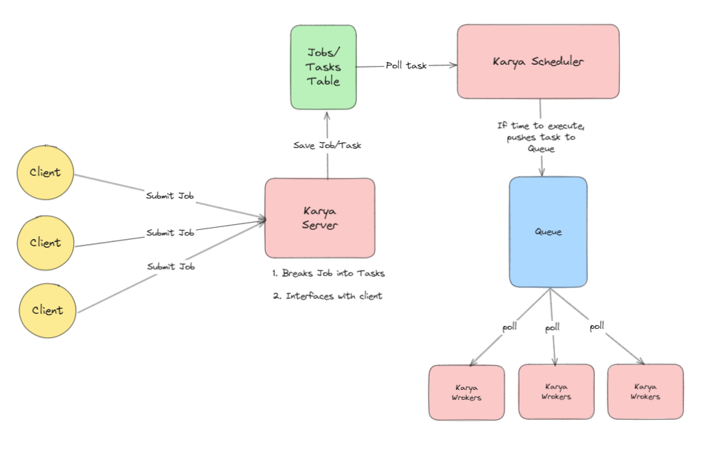

# Karya

Distributed, scalable Job Scheduler built for high throughput.

- [How to contribute](.github/CONTRIBUTING.md)

---

## Overview



### Components

Karya has the following components which helps it achieve its functionality. Note that **all of the components are stateless** hence can be scaled in numbers according to your requirements without any issue.

#### Server

This is a web server via which the client interacts. It has the following functions:

1. Manage users. Only a registered user can schedule a job.
2. Pushes the job to the repo connector from which the scheduler will poll from

### Scheduler

- This is the heart of Karya. it will constantly keep polling the repo, and when it is time to execute the task, will it push to the queue.
- This is the component which has the logic as to when and if the next task is to be scheduled.

This is a configurable component as Karya will look for an environment variable `KARYA_SCHEDULER_CONFIG_PATH` to find the .yml file that the scheduler instance will look for at runtime. The structure of the yml file is as follows:

```yml
application:
  threadCount: 2          // how many threads you want one instance of scheduler to use
  workers: 3              // how many workers within the instance do you want to spin up. Useful when the throughput is high
  fetcher:                // Karya internally fetches the tasks during polling and pushes into an internal queue for the workers to pick up. This here defines properties of the poller
    channelCapacity: 10   // size of the queue which the fetcher pushes to and the workers consume from
    pollFrequency: 300    // polling frequency from the repo, lesser the value, better the precision of when the task should be executed
    executionBuffer: 1000 // This specifies how far back from the time of polling should scheduler fetch an unexecuted task. This should always be higher than pollFrequency
    repoPartitions:       // From which partitions should the scheduler instance should poll from.
      - 1
      - 2
      - 3
      - 4
      - 5
```

[Sample scheduler.yml file](.configs/scheduler.yml)

### Executor

- Executors receive a task from the worker-queue and does the heavy work that the user specifies.
- User can specify what action should the executor perform once it receives the task. This is done via setting an environment variable `KARYA_EXECUTOR_CONFIG_PATH` that the executor will look for to initialize the connector-plugins at run time.
- [Connector-Plugins](./README.md/##connector-plugin) define what operations at the time of execution should the executor support.

  ```yml
  application:
   connectors:                    // this here is the list of connector-plugins and their properties that the executor should support
     - type: "restapi"            // in this example, we are configuring the executor to support a task that involves making a REST call when it has to execute
       configs:
         keepAliveTime: 3000
         connectionTimeout: 1000
         connectionAttempts: 3
  ```

  [Sample executor.yml file](.configs/executor.yml)

---

## Connectors

Karya's "distributed" nature comes not olny from it's ability to scale by spinning up more scheduler/executor nodes. But it leverages the distributed nature of other softwares. To run, it needs at least these 3 components:

1. **Repo** : Karya uses a SQL based database for persistent storage of jobs/tasks/users
2. **Locks** : Karya uses a distributed mutex lock to prevent tasks to prevent race conditions
3. **Queue** : Karya buffers the execution of tasks in queues.

**NOTE** : Karya is built for high throughput and the tradeoff for it is precision as to when a task should be executed. But the hit in precision can be minimized by the configurability that Karya provides albeit at the cost of more resources.

### Supported Connectors

Karya provides ability to just plug and play. Users can easily connect their existing repo/locks/queues with Karya, spin up Karya's nodes and start scheduliing jobs! The following connectors are currently configured to work with Karya with rest more on the way:

| repo        | locks       | queue       |
|-------------|-------------|-------------|
| [Postgres](https://www.postgresql.org/) | [Redis](https://redis.io/)      | [RabbitMQ](https://www.rabbitmq.com/)     |

### How to configure connectors?

Karya looks for an environment variable `KARYA_PROVIDERS_CONFIG_PATH` where it will look for a yml file from which to pick up the configuration. The format of the `providers.yml` file is as follows:

 [Sample providers.yml file](./configs/providers.yml)

```yml

// repo configurations
repo:
  provider: "psql"
  partitions: 5  // how many partitions you would want in your database. Usefull when the throughput is high
  properties:
    hikari:
      // can provide any Hikari datasource properties here
    flyway:
      url: "jdbc:postgresql://localhost:5432/karya"
      user: "karya"
      password: "karya"

// lock configurations
lock:
  provider: "redis"
  properties:
    hostname: "localhost"
    port: 6379
    waitTime: 1000
    leaseTime: 5000

// queue configurations
queue:
  provider: "rabbitmq"
  properties:
    username: "karya"
    password: "karya"
    virtualHost: "/"
    hostname: "localhost"
    port: 5672
```

The above .yml file describes a way where we are using *Postgres as repo*, *Redis as Locks* and *RabbitMQ as queue*. But you can connect any connector of your choice and provided Karya has the ability to support it, it should be okay. 

To swap in a different connector, change the `provider` key in any of repo/lock/queue section and pass in the properties accordingly. The mapping of connector to provider key is as follows:

| connector type       | connector      | provider key       |
|-------------|-------------|-------------|
| Postgres | repo      | psql     |
| Redis | locks      | redis     |
| RabbitMQ | queue      | rabbitmq     |

---

## Connector-Plugins

This here is the section which defines what all actions does Karya supports when a task has to be executed by the executor. Currently, the following connector plugins are available:

| executor.yml key      | description      |
|-------------|-------------|
| restapi | This plugin helps support the executor make a REST Api call |
